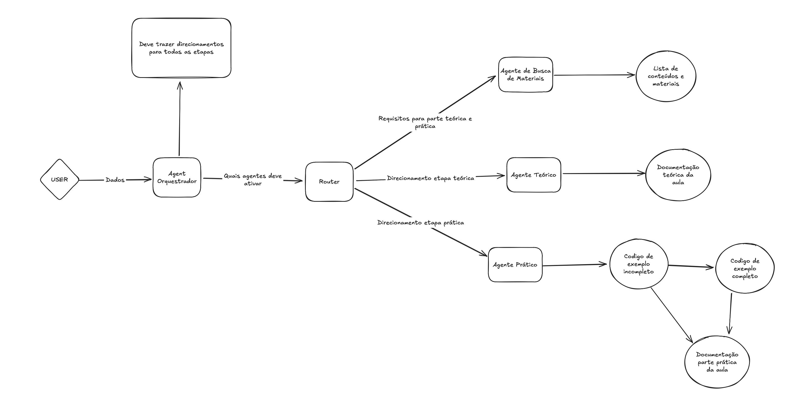

# 🎓 Criar Aulas IA

Sistema automatizado para criação de aulas de programação utilizando agentes de IA com LangChain e LangGraph.

## 📋 Descrição

Este projeto utiliza múltiplos agentes de IA orquestrados para gerar automaticamente:
- ✅ Material de referência (artigos, vídeos, cursos)
- ✅ Documentação teórica completa
- ✅ Código completo de exemplo
- ✅ Código incompleto para exercícios
- ✅ Documentação prática passo a passo para estudantes

## 🏗️ Arquitetura

O sistema é baseado em **LangGraph** com 5 agentes especializados orquestrados por um Router:



**Fluxo de Execução:**

```
USER → Agent Orquestrador → Router → [Search Agent | Theory Agent | Practical Agent]
                                    ↓
                            Lista de conteúdos e materiais
                            Documentação teórica da aula
                            Código de exemplo (incompleto → completo) → Documentação prática da aula
```

### Agentes

1. **Search Agent** (`search_agent.py`)
   - Busca materiais de referência usando Tavily Search
   - Retorna artigos, vídeos e cursos relevantes por tópico

2. **Theory Agent** (`theory_agent.py`)
   - Gera documentação teórica estruturada
   - Utiliza web scraping para enriquecer conteúdo com referências

3. **Complete Code Agent** (`complete_code_agent.py`)
   - Cria código completo e funcional baseado na teoria

4. **Incomplete Code Agent** (`incomplete_code_agent.py`)
   - Gera versão com lacunas para exercícios práticos

5. **Practical Documentation Agent** (`pratical_doc.py`)
   - Cria guia passo a passo comparando código completo e incompleto
   - Fornece hints e explicações pedagógicas

## 🚀 Instalação

### Pré-requisitos

- Python 3.13+
- OpenAI API Key
- Tavily API Key

### Setup

1. Clone o repositório:
```bash
git clone https://github.com/pedropinrodrigues/criar_aulas_ia.git
cd criar_aulas_ia
```

2. Crie e ative o ambiente virtual:
```bash
cd src
python3 -m venv .venv
source .venv/bin/activate  # No Windows: .venv\Scripts\activate
```

3. Instale as dependências:
```bash
pip install -r requirements.txt
```

4. Configure as variáveis de ambiente:
Crie um arquivo `.env` na raiz do projeto:
```env
OPENAI_API_KEY=sk-...
TAVILY_API_KEY=tvly-...
```

## 📖 Uso

### Execução Básica

```bash
cd src
python3 -m graph
```

### Configuração da Aula

Edite o `graph.py` para customizar os parâmetros:

```python
initial_graph_state = GraphState(
    materials={
        "title": "Introduction to Python Programming",
        "public_type": "beginner",
        "topics": ["Variables and Data Types", "Control Structures", "Functions"],
        "result": [],
    },
    theory_class={
        "title": "Python Fundamentals - Variables and Control Flow",
        "content": "Descrição do conteúdo da aula...",
        "student_level": "beginner",
        "duration_minutes": 45,
        "references": [
            "https://docs.python.org/3/tutorial/introduction.html",
            "https://realpython.com/python-data-types/"
        ],
        "result": "",
    },
    pratical_class={
        "theory_documentation": "",
        "language": "Python",
        "student_level": "beginner",
        "complete_code": "",
        "incomplete_code": "",
        "pratical_documentation": "",
    },
)
```

### Output

Os resultados são salvos automaticamente em:
- `logs_execucao/materials_result.md` - Materiais de referência
- `logs_execucao/theory_class_result.md` - Documentação teórica
- `logs_execucao/complete_code.md` - Código completo
- `logs_execucao/incomplete_code.md` - Código com lacunas
- `logs_execucao/pratical_documentation.md` - Guia prático para alunos

## 🧪 Testando Agentes Individualmente

Cada agente pode ser testado separadamente:

```bash
# Testar search agent
python3 -m agents.search_agent

# Testar theory agent
python3 -m agents.theory_agent
```

## 📁 Estrutura do Projeto

```
criar_aulas_ia/
├── src/
│   ├── agents/
│   │   ├── search_agent.py          # Busca materiais
│   │   ├── theory_agent.py          # Gera teoria
│   │   ├── complete_code_agent.py   # Cria código completo
│   │   ├── incomplete_code_agent.py # Cria código incompleto
│   │   └── pratical_doc.py         # Gera documentação prática
│   ├── schemas/
│   │   └── state_classes.py        # TypedDicts do GraphState
│   ├── graph.py                    # Orquestração dos agentes
│   └── .env                        # Variáveis de ambiente
├── logs_execucao/                  # Outputs gerados
├── output_result.txt               # Resultado consolidado
└── README.md
```

## 🔧 Tecnologias

- **LangChain** - Framework para aplicações com LLMs
- **LangGraph** - Orquestração de agentes com grafos
- **OpenAI GPT-4o-mini** - Modelo de linguagem
- **Tavily Search** - API de busca para agentes
- **BeautifulSoup4** - Web scraping
- **Python 3.13** - Linguagem base

## 🎯 GraphState Schema

```python
class GraphState(TypedDict):
    materials: Materials          # Materiais de referência
    theory_class: TheoryClass    # Aula teórica
    pratical_class: PraticalClass # Aula prática
```

### Materials
```python
{
    "title": str,
    "topics": list[str],
    "student_level": str,
    "result": list[MaterialsDto]
}
```

### TheoryClass
```python
{
    "title": str,
    "content": str,
    "student_level": str,
    "duration_minutes": int,
    "references": list[str],
    "result": str  # Markdown gerado
}
```

### PraticalClass
```python
{
    "theory_documentation": str,
    "language": str,
    "student_level": str,
    "complete_code": str,
    "incomplete_code": str,
    "pratical_documentation": str
}
```

## 🤝 Contribuindo

1. Fork o projeto
2. Crie uma branch para sua feature (`git checkout -b feature/NovaFeature`)
3. Commit suas mudanças (`git commit -m 'Add: nova feature'`)
4. Push para a branch (`git push origin feature/NovaFeature`)
5. Abra um Pull Request

## 📝 Licença

Este projeto está sob a licença MIT.

## 👤 Autor

**Pedro Pin Rodrigues**
- GitHub: [@pedropinrodrigues](https://github.com/pedropinrodrigues)

## 🐛 Issues

Encontrou um bug? Abra uma [issue](https://github.com/pedropinrodrigues/criar_aulas_ia/issues).

---

⭐ Se este projeto foi útil, considere dar uma estrela!
